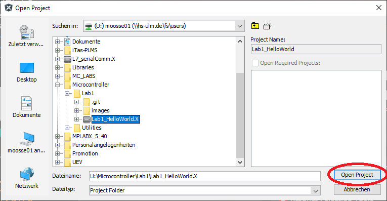
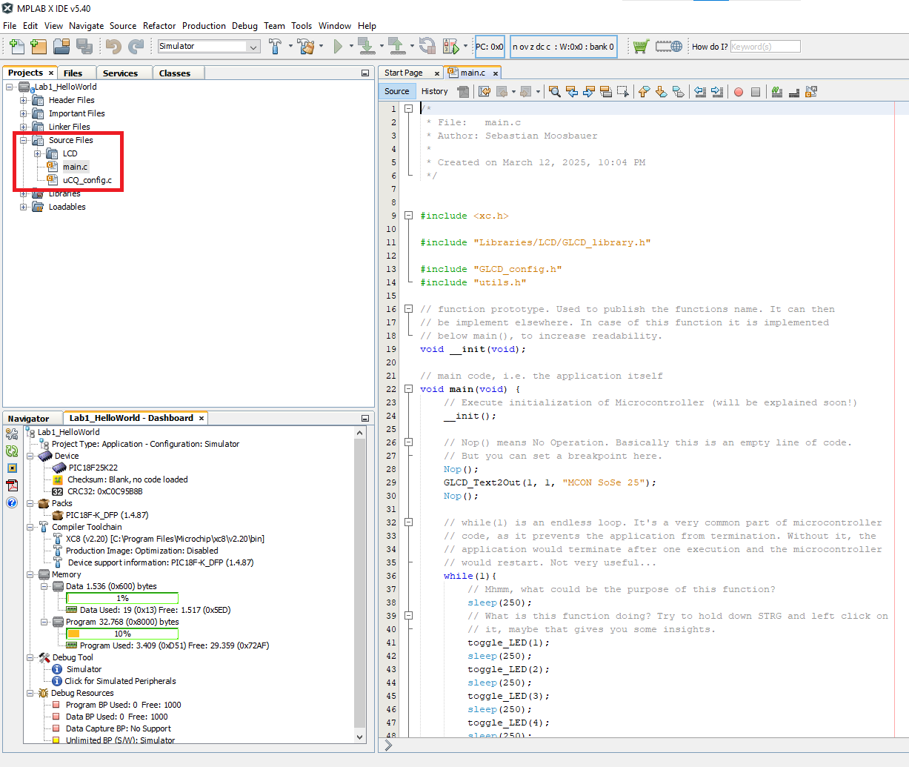

# Lab1 "Hello World"
In this laboratory you will 
- get to know the IDE used within this lecture
- execute, simulate, and debug your code and
- optional: recap basisc of programming in C.

Therefore we will first open this Project in MPLAB, flash the code to our Microcontroller and check what it is doing. Afterwards, we will set our first breakpoints to check if we understand the code.
To get used to the debugging features of MPLAB we will simulate the code within MPLAB and stop the time relevant for execution. And last but not least we will change the code to recap some basics of programming in C.

## Excercise 1 - Get the project and open MPLAB X
In order to get the MPLAB project you will work with today, you need to use git.
You can find a manual for Git [here](https://github.com/MicrocontrollerApplications/Utilities/blob/feature_add_git_doc/git.md).

Afer you successfully cloned the project, it's time to open our IDE - MPLAB X v5.20. Therefore, you simply need to double click the Desktop icon, as shown below.

## Excercise 2 - Open the project
Before you open the IDE, please plug in the red usb-cable into an USB-Port of your PC. Afterwards, connect the PicKIT3 (small red device) with that cable and plug the development board into the PicKIT3. Now you can proceed with opening the project.

After opening MPLAB you need to open the previously cloned project. Therefore, we need to 
1. **click the "Open Project..." button**
   
1. **navigate to the directory we cloned our project to (U:\Microcontroller\Lab1)**
    
1. **select our project *Lab1_HelloWorld.X* and click "Open Project"**
   
1. **open main.c**
   

## Excercise 3 - Flash the Microcontroller
For today we will not cover the details of how the microcontroller is flashed and which intermediate steps are relevant for that. Today we want to see the outcome of our code on our development board.
Thus, the only thing we do today is pressing the "Debug Project(...)" button. 

After clicking you will be promted to choose a tool. Please use the PicKIT3, which is verly likely the last tool in the list.

After a while you should see some changes on the deveopment board. If so, move on to excercise 4. If not, ask for help. :)

## Excercise 4 - Check if you understand the code
Now, as you see what the code is doing on the development board, check if you understand the relation between code and the development boards behaviour.
Prepare yourself to explain every line of code from line 28 to 51 within the votation in the next lecture. In case of doubts, ask for help.
For better understanding, you can set breakpoints to pause the program's execution and see what the board is doing if particular lines of code are executed.
Therefore, set a Breakpoint in line 28 and 31 by clicking on the line numbers. A red square should appear there. **Do not set more than two breakpoints**

Now start the code execution in Debug mode -> 

The program will stop at line 28 and wait for you to continue it. You can either continue the program with the continue-button  or execute only the next line of code with the step-over-button .
Feel free to experiment with those two options.

In case you want to further debug the code, you can set new breakpoints. But, you first need to pause the program's execution using the pause-button  before changing the breakpoints **and** you need to make sure not to use more than two breakpoints in parallel, as the hardware does not support that.
This feature might be helpful to find the source for the error message on the display ***!!! INCORRECT LED***.

## Excercise 5 - Simulate the code and stop execution time
Now that we flashed our first program to the microcontroller it's time to explore another feature of MPLAB X - the simulator. This tool is very handy if you need to analyze your code without the need for real hardware. A good exmaple for such a case is to investigate timings.

Thus, we now will check if our sleep command really take 250 ms and if we can guess the the execution time for one iteration of our endless loop correctly.

Therefore, we will
1. **change the project configuration from PicKIT3 to Simulator (more on configurations in future laboratories)**
   
3. **set a breakpoint in line 39 (you should know how that works)**
4. **open the stopwatch window**
   
   
   
6. **run the code and check the expired time for one iteration or our loop**
   

Did you guess the right execution time? If not, try to use breakpoints and the stopwatch window to find out which line of code takes longer than expected. Feel free to ask for help if you need assistance.

## Excercise 6 - Change the code (optional)
Currently our code does not look so nice with all those repeated lines of code. Wouldn't it be much nicer to have a loop doing repeatedly executed stuff, such as toggling LEDs?
Try to use a for-loop (google the syntax in C, if necessary) to toggle all LEDs in the same way as done now.
Afterwards, check the necessary execution time for the for loop, is it comparable with the previous approach?
